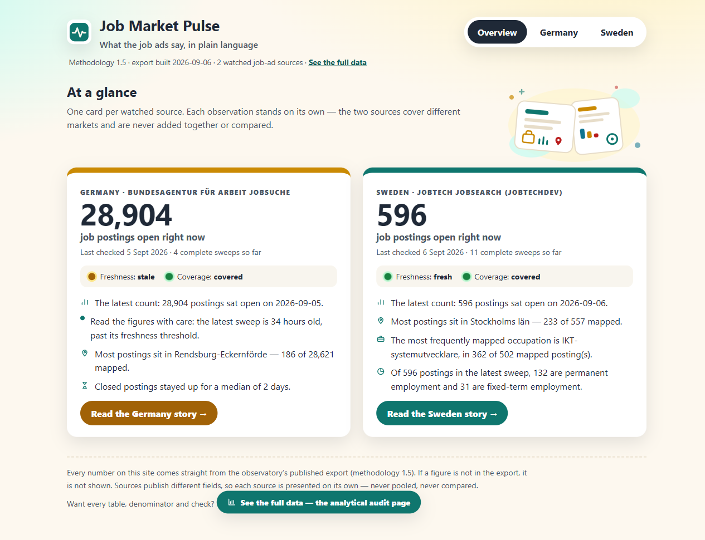
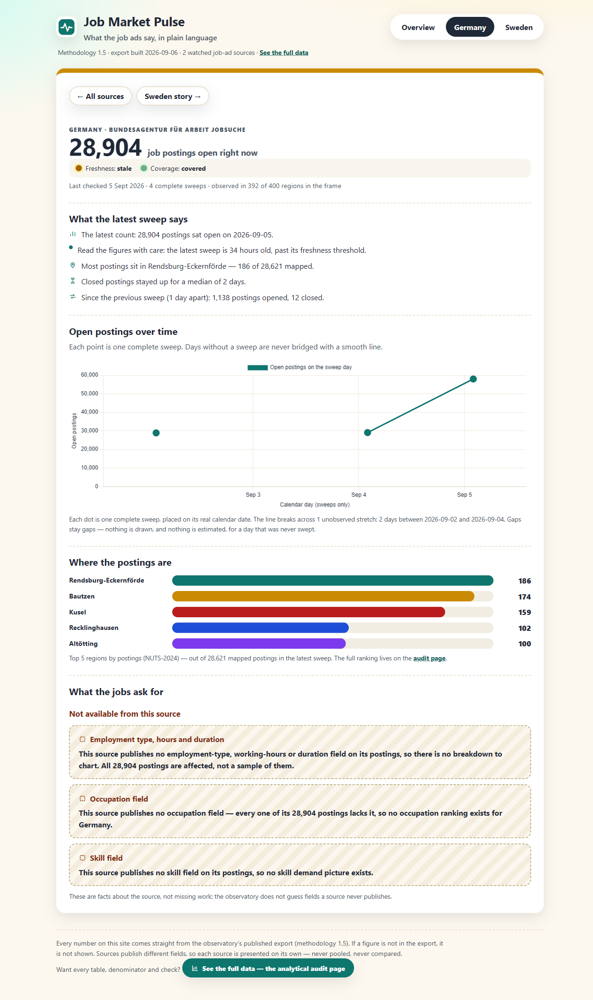

# EU Tech Labour Observatory

A quiet, aggregate record of public technology job-posting demand in Europe, published as two
self-contained surfaces: a plain-language dashboard app and a no-JS analytical audit page.
Everything is reproducible offline: the only commands that touch the network are the ones that
collect data.



The observatory does not estimate, model, or interpolate. It publishes what a public job-posting
source actually said, with the denominator beside every ranking, the pinned reference versions
beside every mapped figure, and unresolved values shown as their own rows rather than dropped.

## Status

*As of 2026-09-06 — documentation, not a gate; the pages themselves carry the current numbers.*

- **Sources:** two collecting scopes. JobTech Development / Arbetsförmedlingen `JobSearch`
  (Sweden, keyword scope), and BA Jobsuche (Germany) collected by the sister scraper lab as the
  `ba/de-nuts3-panel` scope under the owner-relaxed ToS/robots gate recorded in
  `SOURCE_FEASIBILITY.md`.
- **Data:** 15 stored sweeps — 11 Swedish (596 postings in the latest) and 4 German panel sweeps
  (28,904 postings in the latest, 28,621 mapped to a region, covering 392 of 400 German NUTS-3
  regions).
- **Sampling design:** the German scope is a stratified region-bounded sample with a capped
  within-stratum draw over a frozen 400-region NUTS-3 panel — not a census and not a partial
  crawl; the caveat beside its figures is the panel's own manifest string. The Swedish keyword
  scope is a keyword-scoped query, not a sample.
- **Occupation gap, stated rather than papered over:** the BA search surface carries no
  structured occupation field, so the German occupation and skill rankings are empty by
  construction — job titles and free text are never classified.
- **Published dimensions:** postings by country and NUTS region (with a region-breadth count
  against the pinned NUTS-3 frame), ranked ESCO occupations and skills, employment type,
  working-hours type, contract duration, posting survival and flows, mapping quality, coverage
  and freshness.
- **Reference data, all pinned:** NUTS-2024, JobTech Taxonomy v30, ESCO 1.2.1. Methodology
  version 1.5 is stamped in the page footer and in every CSV export.
- **Portfolio artefact:** `docs/index.html` is a committed copy of the last live build; rebuild
  it with `make live-site` and copy `site/build/index.html` back to `docs/`.

## Quick start

```sh
uv sync          # install the locked environment (the only step that needs the network)
make check       # the offline gate: lint, types, 63 Python tests, mapping evaluation, 190 dbt resources
make site        # build site/build/index.html from the committed synthetic sample
```

Open `site/build/index.html` in any browser. There is no server, no port, no login, and no build
configuration to edit.

## Two surfaces

The observatory publishes the same checked numbers twice, for two different readers:

- **The app — `app/` ("Job Market Pulse").** Charts-first and plain-language: one card per
  watched source, trend lines that keep their gaps, top regions, requirement stacks, and a
  visible "not available from this source" card when a source publishes no field. It renders a
  fixed, gated JSON export and computes nothing itself — if a number is not in the export, it
  is not shown. Run it:

  ```sh
  make export-app                # rebuild app/data.json from the stored sweeps
  cd app && npm install && npm run dev    # or serve the built app/dist/
  ```

  The renderer-not-analyser rule and the app's own honesty laws live in `app/README.md`.

- **The audit page — `docs/index.html`.** One self-contained static HTML page, readable without
  JavaScript, with every table, denominator, suppression flag, and mapping chip. This is the
  analytical surface; rebuild it with `make live-site` and copy `site/build/index.html` back to
  `docs/`.



| Command | What it does | Network |
| --- | --- | --- |
| `make check` | The quality gate. Never touches the network, by design. | Never |
| `make site` | Rebuilds the page from the committed synthetic sample. | Never |
| `make live-site` | Rebuilds the page from stored collection partitions. | Never |
| `make release-check` | Inspects the built page against the publication rules. | Never |
| `make export-app` | Rebuilds `app/data.json` (the app's gated export) from stored partitions. | Never |
| `npm run dev` / `npm run build` | Serves / builds the app from `app/` (`npm install` first). | Never |
| `make auto` | Runs one full unattended loop: sweep, gates, both surfaces, artefact commit. | Yes |
| `make sweep` | Collects one complete sweep from the live source. | Yes |
| `make reference` | Rebuilds the pinned crosswalks from the JobTech Taxonomy API. | Yes |

## Automation

Two user-level Windows scheduled tasks (no elevation needed) run the whole publish loop
unattended — sweep, gates, both published surfaces, then one pathspec-scoped artefact
commit:

| Task | Cadence (local time) | Command |
| --- | --- | --- |
| Observatory SE sweep | daily 07:30 and 19:30 | `make auto SOURCES=jobtech` |
| Observatory BA sweep | daily 13:00 (owner-chosen slot; the PC is off overnight) | `make auto SOURCES=ba` |

Missed slots (PC off) self-heal: start-when-available fires the run at the next logon,
and the orchestrator's spacing guard prevents a catch-up over-sweep.

```powershell
# install (registers both tasks disabled; -Enable registers them enabled)
powershell -ExecutionPolicy Bypass -File scripts\install_scheduled_tasks.ps1
# uninstall (reversible)
powershell -ExecutionPolicy Bypass -File scripts\install_scheduled_tasks.ps1 -Remove
```

A disabled task never fires on schedule; enabling is one command:
`Get-ScheduledTask "Observatory SE sweep", "Observatory BA sweep" | Enable-ScheduledTask`.

To see what automation would do right now — partition ages, spacing verdicts (JobTech at
least 2 h, BA at least 20 h between sweeps), freshness, and the newest run's log tail:

```sh
uv run --offline python scripts/auto_sweep.py --status
```

When a scheduled run fails: **read the log** (`logs/auto/<run id>.log`; `--status` prints
the newest tail). The orchestrator **never commits a red gate**: any failing step stops the
run before `git commit` and exits non-zero, so a failed run leaves the repository exactly
where it was. Stored partitions are append-only — **never delete one**; a bad sweep is
superseded by the next sweep, not removed.

## Use cases

Each question is answered **per scope, never across** — the two sources cover different markets
under different sampling designs and are never pooled or ranked against each other.

- **Where demand concentrates** — which NUTS-3 regions carry the postings, with a breadth count
  against the pinned region frame (392 of 400 German regions, 20 of 21 Swedish regions).
- **Employment and contract shapes** — for the Swedish scope: employment type, full-time vs
  part-time, and contract duration, each counted out of the full sweep denominator.
- **What the jobs ask for** — ranked ESCO occupations and skills for the Swedish scope, with
  denominators beside every ranking.
- **Freshness and coverage** — how old the latest sweep is against the source's threshold, how
  many rows the sweep covered, and posting survival and flows between sweeps.
- **What is absent, and why** — Germany's occupation, skill, employment-type, hours, and duration
  figures are empty because the source publishes no such field; the observatory states that as a
  fact about the source rather than guessing.

**Limitations.** The Swedish scope is a keyword-scoped query, not a census of the Swedish job
market. The German scope is a capped stratified sample over a frozen 400-region panel, so its
rankings are collected counts within that design, not national totals. No education dimension
exists anywhere in these sources, so none is published. And the two countries are never
comparable by design — different sources, different scopes, different sampling.

## How it works

1. **Collect** — `scripts/collect.py` reads one complete sweep page by page and stores it as an
   append-only partition beside a manifest of expected and observed rows. Stored partitions are
   never rewritten, so a posting that disappears becomes an event rather than a deletion.
2. **Enrich** — `scripts/enrich.py` maps structured geography, occupation, skill, and requirement
   fields onto the pinned references. Free text is never classified.
3. **Sanitize** — `scripts/sanitize.py` is the privacy boundary: it pseudonymises the native posting
   id under a versioned HMAC secret and keeps only allowlisted fields. Posting text, employer names,
   URLs, and native identifiers never cross it.
4. **Transform** — dbt builds views only (`transform/`), each under an enforced column contract with
   data tests.
5. **Publish** — `scripts/publish.py` queries those views and writes one static page: no external
   assets, no analytics, no network access at build time, and no JavaScript required to read it.

## Repository layout

```
app/              the dashboard app (Vite + React + Chart.js) - renders the gated export only
docs/             the committed audit page (index.html), usability protocol, and screenshots
docs/screenshots/ committed screenshots of both surfaces
scripts/          collector, enrichment, privacy boundary, publisher, evaluation, release check
transform/        dbt models, contracts, and data tests
data/reference/   pinned crosswalks: NUTS, JobTech->ESCO occupation and skill, requirement labels
data/sample/      committed synthetic sample and the mapping quality report
data/raw/         stored collection partitions - private, append-only, never committed
tests/            one offline test module and its fixtures
site/build/       the generated page - not committed, rebuild it with make site
```

## Privacy and licensing

Only aggregates are published. Native identifiers, source URLs, employer names, and posting text are
absent by construction rather than removed afterwards. Small-count suppression applies to the
posting-flow and survival views; latest-sweep distributions are published in full and are
single-dimension only, never cross-tabulated.

Code is MIT licensed (`LICENSE`). Source data stays under its own licence: aggregates derived from
JobTech Development / Arbetsförmedlingen may be republished with attribution, while posting text and
identifiers may not, and are not available here.

## Development log and where to look

`SESSIONS.md` records every increment: what was built, what was measured, what was deliberately not
done, and the gate result. It is the project's memory — read the most recent entries before changing
anything.

- `app/README.md` — the app's own rules (renderer, not analyser) and how to run it.
- `docs/usability-study-protocol.md` — the prepared, unrun usability study.
- `.kilo/plans/` — the archived execution plans each session followed.
